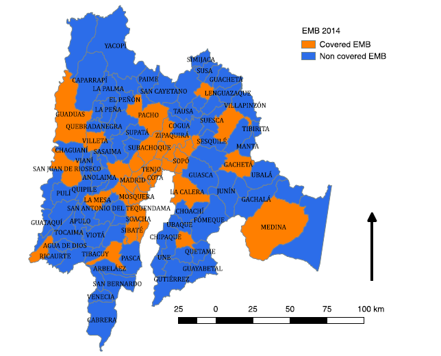
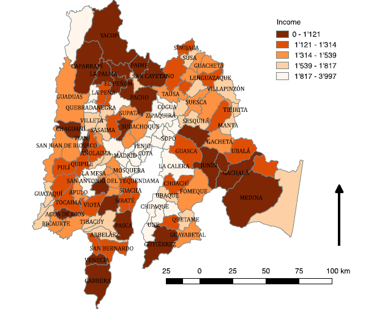

```{r setup, include=FALSE}
knitr::opts_chunk$set(echo = TRUE)
```

```{r, warning=F, message=F, echo = FALSE, include = FALSE}
Route <- "E:/FODEIN/SAE_EMB/"
setwd(paste0(Route, "scripts"))
source("4.AverageIncome_DirectFHEstiations.r")
setwd(paste0(Route, "scripts"))
source("4.PropUnemployment_DirectFHEstiations.r")
setwd(paste0(Route, "scripts"))
source("5.Plots.r")
```
# ABSTRACT

Small Area Estimation Methodology (SAE) is a widely used by statistical offices in several countries to reduce sampling errors with the help of auxiliary information. Different countries such as USA, Canada, England, Israel and European Community have within their statistical institutes offices dedicated to the application of SAE in several investigations.
So far, the National Administrative Department of Statistics of Colombia (DANE), has not published official statistics that involve this methodology, reason why, this work illustrates the advantages in the use and estimation of living conditions using SAE. Formally, the unemployment rate and the average income levels of municipalities of Cundinamarca are estimated. For this purpose, information of the Multipurpose Survey 2014 it is used and is complemented with socio-demographic and economic related auxiliary information. A mixed Fay & Herriot (1979) model it is used in order to get the estimates.

We use R ecosystem to develop SAE methodology. R is used for data wrangling, model adjustment, parameter estimation and finally visualization with the aid of renowned packages such as tidyr, forcats, sae, ggplot2 among others are used.

We will show R implementation and some remarkable results, first, a good adjustment of the model to the data, second, a reduction in the sampling errors reported by the estimation in small areas compared to the direct estimates generated by the Bogotá Multipurpose Survey (EMB) and, third, acceptable estimates for municipalities that were not covered by the survey.

**Keywords**:
 Small Area Estimation, Survey Sampling, Tidyvese, Household Survey, Colombia, Cundinamarca Municipalities.
**JEL classification**: C63 , C83, C88  

# INTRODUCTION

Obtaining reliable estimates for municipalities or smaller geographical areas has been an impossible task for household surveys with traditional sampling methodologies due to budget aspects and operative costs. In the present work we seek to obtain precise estimates at municipality level of average income and unemployment rate for Cundinamarca to achieve more effective public policies. 

Cundinamarca is one of 32 departments that formed Colombia with 116 municipalities including Colombian capital Bogotá. In this study we make estimations of average household income and unemployment rates in 115 municipalities (excluding Bogotá due to administrative reason and for sake of a better adjustment in estimations).

Multipurpose Survey covers 32 municipalities, including Colombian Capital, Bogotá which will not be taken account in this study because Bogotá is an outlier municipality in terms of average income and it has a very different economic dynamic to other Cundinamarca municipalities due to its condition as capital and biggest city in terms of population, economic development, etc. More details of the survey are found in [@EMB2014].

In this study we have two main goals: 

* To optimize the production of official statistics by improving the estimates of the average income and the unemployment rate for observed Cundinamarca municipalities in the 2014 Multipurpose Survey. 

* To provide estimations of both, average income and unemployment rate for noncovered municipalities in the 2014 Multipurpose Survey.

In this work we use R ecosystem different in stages such as:

* Data Wrangling of auxiliary information to municipality level and multipurpose sampling dataset (EMB).

* Direct estimates of average household income by municipality, unemployment rate and their respective variances by municipality.

* Estimates of average household income by municipality and unemployment rate by municipality using SAE in particular Fay -  Herriot model.

* Visualization.

R code for reproducibility can be obtained from https://github.com/josezea/sae_emb


# LITERATURE REVIEW

There are two main approaches in survey sampling theory: design-based survey sampling [@sarndal992] and model-based survey sampling. [@molina2015].

## Direct estimators for domains
In design-based approach the values of the interest variable $y$ are considered as fixed and the sample is considered as a random variable. In this approach each sample has a probability $p(s)$ to be selected. In general, $p(s)$ is not straightforward to compute, in order to estimate parameters such as total, mean, ratio and proportions is enough to have only inclusion probabilities. The inclusion probability is computed as:
$$\pi_k = \sum_{s \supset k} p(s)$$

An umbiased direct estimator (under the survey design $p(s)$) for the population total is the Horvitz-Thompson (HT) estimator:

$$t_{y\pi} = \sum_s \frac{y_k}{\pi_k}= \sum_s w_k y_k$$
HT estimator is widely used to produce official statistics. HT estimator can be written in terms of expansion factor or survey weight, $w_k$ which is the inverse of inclusion probabilities $\frac{1}{\pi_k}$.


A direct estimator (not unbiased) for the mean is: 

$$
\begin{equation}
\hat{\overline{Y}} = \frac{\sum_s w_ky_k}{\sum_s w_k} 
\end{equation}
$$
Above estimator is a ratio estimator. The previous estimator is a particular case of a ratio estimator,
$$R = \frac{t_{y\pi}}{t_{z\pi}}$$. An example of a ratio is the unemployment rate, which is calculated with the previous expression.

In many occasions the interest is the estimation of parameters for subpopulations such as age groups, municipalities, combination between age groups and sex categories, etc. Those groups are called domains. Estimation of parameters in domains can be done through direct estimators and SAE methodology. The direct estimation of total for domain $d$ is get as follows: 

$$\hat{t}_{y\pi,d} = \sum_s \frac{y_k z_{dk}}{\pi_k}= \sum_s w_k y_k  z_{dk}$$, where $z_{dk}$ is one if   element k is in the domain $d$ and zero in other cases.

An estimator for the mean can be computed as:

$$\hat{\overline{Y}}_{d} = \frac{\hat{t}_{y\pi,d}}{\hat{N}_d} = \frac{\sum_s\frac{y_{dk}}{\pi_k}}{\sum_s\frac{z_{dk}}{\pi_k}}=\frac{\sum_s w_k y_{dk}}{\sum_s w_k z_{dk}}$$, where $z_{dk}$ is one if element k is in the domain $d$ and zero in other cases and $y_{dk} = y_kz_{dk}$.


## Fay-Harriot estimator
Small area estimation (SAE) refers to estimation in domains (population subgroups) which have a relatively small sample size. Some examples of a small area are counties, city administrative division (for example, localities in Bogotá). In this research municipalities of Cundinamarca are considered as small area. 

SAE is used to carry on the estimation of parameters for domains (small area) with a mixed approach between design-based and model-based estimation. SAE is based in the adjustment of mixed models which take into account within-domain variance. Auxiliary information for small area is added to decrease survey sampling error and therefore and increase in quality of the estimations. There are two main classes of SAE estimators: individual - level models (Battese - Harter - Fuller model) and area-level models (Fay - Herriot). [@molina2015]

Fay - Herriot (FH) model links estimated average of interested variable in the area $d$ (for $d=1, \ldots D$) with auxiliar information vector $z_d$:
$$\hat{\overline{Y}}_d =\mathbf{z}_d^t\beta + u_d + e_i$$, where $u_i \sim N(0,\sigma^2_v)$, $e_i \sim N(0,\Sigma_e)$, with $\Sigma_e = diag(D_1,D_2,...D_m)$. In above equation $\mathbf{z}_d^t\beta+u_d$ is the unknowk average for $d$th area 

The best linear unbiased predictor (BLUP) for $\theta_d$, with  $\beta$, 
$\sigma^2_v$ and $D_d$ known is get as follows:

$$\begin{equation}
\hat{\bar{Y}}_d^{BLUP} =
\begin{cases}
\mathbf{z}_d^t \beta + \gamma_d \left(\hat{\bar{Y}}_d - \mathbf{z}_d^t \beta\right) &
\text{Si } d \in A\\
\mathbf{z}_d^t\beta & \text{if } d \notin A
\end{cases}
\end{equation}
$$

where $\gamma_d=\frac{\sigma^2_v}{\sigma^2_v+D_d}$ and $A$ denotes the selected areas in the sample.

When $\beta$ y $\sigma^2_v$ are estimated we obtained the empirical best linear unbiased predictor (EBLUP). The computation of EBLUP is carried on as:

$$\hat{\bar{Y}}_d^{FH}=\begin{cases}
\mathbf{z}_d^t\hat{\beta}+\hat{\gamma_d} \left(\hat{\bar{Y}}_d- \mathbf{z}_d^t\hat{\beta}\right)& \text{Si }d \in A\\
\mathbf{z}_d^t\hat{\beta} & \text{Si }d \notin A
\end{cases}
$$

EBLUP can be seen as an weighted average of direct estimation $\hat{\bar{Y}}_d$ and indirect estimation $\mathbf{z}_d ^ t \hat{\beta}$.
If $\hat{\gamma}_d$ is close to $1$,  $\hat{\bar{Y}}_d^{FH}$ is similar to $\hat{\bar{Y}}_d$, in the other hand if $\hat{\gamma}_i$ is closed to $0$, the estimator $\hat{\bar{Y}}_d^{FH}$ tends to $\mathbf{z}_d^t\hat{\beta}$


## Mean Square error for Fay - Harriot Estimator
The Mean Square Error: [@prasad90] provides an approximation of mean square error of Fay-Herriot estimator which depend of estimation method of $\beta$ and $\sigma^2_u$.  With moments method (method developed by the same authors) and restricted maximum likelihood - REML the mean square error of estimations is obtained as:

$$
\begin{equation}
MSE(\hat{\bar{Y}}_i^{FH})=
\begin{cases}
g_{1i}(\hat{\sigma}_u^2)+g_{2i}(\hat{\sigma}_u^2)+2g_{3i}(\hat{\sigma}_u^2)& \text{Si }i \in A\\
\mathbf{z}_i\left( \mathbf{ZV}^{-1}\mathbf{Z^t}\right)^{-1}\mathbf{z}_i^t +\hat{\sigma}_u^2 & \text{Si }i \notin A\\
\end{cases}
\end{equation}
$$
where 

$$\begin{equation}
g_{1i}(\hat{\sigma}_u^2)=\dfrac{\hat{\sigma}_u^2 D_i}{\hat{\sigma}_u^2+D_i}, \qquad g_{2i}(\hat{\sigma}_u^2)=\dfrac{D_i^2}{(\hat{\sigma}_u^2+D_i)^2}\mathbf{z}_i^t\left( \mathbf{Z^tV}^{-1}\mathbf{Z}\right)^{-1}\mathbf{z}_i
\end{equation}
$$
and
$$\begin{align}
&g_{3i}(\hat{\sigma}_u^2)=\left(\dfrac{2D_i^2}{m(\hat{\sigma}_u^2+D_i)^3}\right) \left( \hat{\sigma}_u^4+2\hat{\sigma}_u^2\sum_{i=1}^m\,D_i/m+\sum_{i=1}^m\,D_i^2/m \right) \text{with} &\mathbf{V}=diag(\sigma_u^2+D_1,...,\sigma_u^2+D_m)
\end{align}
$$
On the other hand, with maximum likelihood, the mean square error is computed for $\beta$ and $\sigma^2_u$ as follows:

$$\begin{equation}
MSE(\hat{\bar{Y}}_i^{FH})=
\begin{cases}
g_{1i}(\hat{\sigma}_u^2)+g_{2i}(\hat{\sigma}_u^2)+2g_{3i}(\hat{\sigma}_u^2)-b_i(\hat{\sigma}_u^2)\bigtriangledown\,g_{1i}(\hat{\sigma}_u^2)
& \text{Si }i \in A\\
\mathbf{z}_i\left( \mathbf{ZV}^{-1}\mathbf{Z^t}\right)^{-1}\mathbf{z}_i^t +\hat{\sigma}_u^2 & \text{Si }i \notin A\\
\end{cases}
\end{equation}
$$
With $g_{1i}(\hat{\sigma}_u^2)=\dfrac{\hat{\sigma}_u^4}{(\hat{\sigma}_u^2+D_i)^2}$ y 

$$
\begin{equation}
b_i(\hat{\sigma}_u^2)=-tr\left( \left[ \sum_{i=1}^m\,(\hat{\sigma}_u^2+D_i)^{-1}\mathbf{z}_i^t\mathbf{z}_i \right]^{-1} \left[\sum_{i=1}^m\,(\hat{\sigma}_u^2+D_i)^{-2}\mathbf{z}_i^t\mathbf{z}_i   \right]\right) \left( \sum_{i=1}^m\,(\hat{\sigma}_u^2+D_i)^{-2}\right)^{-1}
\end{equation}
$$

## Basic concepts Bogota Multipurpose Survey (EMB)

In EMB survey analyzed population corresponds to houses, households and persons. 
In this study all economically active household members were considered, household members were grouped according to occupational situation:

a. Working Population: It is made up by people who are working, performing some paid activity or who have a job or business for which they receive income. This group also includes people who worked last week without compensation.

* Employees:  Laborer, private company employee, public employee, domestic employee, hired laborer. 

* Independent worker: People who performed the last week some activity pays for one hour or more or had some work or business and who perform at work in the following activities:
private enterprise Worker/Employee, government employee, domestic employee, day laborer.

* Unpaid Worker: People who performed the last week some activity pays for one hour or more or had some work or business and who perform at work in the following activities: unpaid assistant, unpaid family worker, unpaid worker.


b. Unemployed: It is made up by people who are not working, and not performing some paid activity or who have a job or business for which they receive income. This group excludes people who worked last week without compensation.

Household members can get revenues from rental income, financial aid, sales, pension etc.

Employees get earnings mainly from salary, bonus, payment in kind (food, transportations, etc), subsidies, indemnities and others. Independent workers get earnings related with some activity.


In order to compute unemployment is necessary to identify employed and economically active persons. In order to achieve that DANE provides next definitions: 

* Population of working age (PWA): This group is made up of people aged 12 and over in urban areas and 10 years and over in rural areas.

* Economically Active Population (EAP): Also called labor force and is made up of people of working age who are working or are looking for a job.

* Economically Inactive Population (EIP): It is made up of people of working age who neither work nor are looking for a job.

* Employed (E): it is made up by economically active population who in the reference period were in one of the following situations: worked for at least one hour paid in cash or in kind in the reference week, those who did not work the reference week, but had a job, unpaid family workers who worked in the reference week for at least 1 hour.

Unemployed (U): It is made up by economically active population who in the reference period is not in any situation described for employed people. 

DANE methodology for compute unemployed rate is estimate the ratio $\frac{\text{Total unemployed}}{\text{Total EAP}}$. 

# METHODOLOGY

## Data wrangling

The datasets corresponding to occupational condition was used in order to compute income for every household of Cundinamarca municipalities and unemployment for surveyed people residing in Cundinamarca.

Data wrangling was carried on using R tidyverse packages. For data importation we used haven [@haven] for datasets in .sav format (IBM SPSS), readr[@readr] for text files and readxl [@readxl]  to read xls and xlsx files. dplyr [@dplyr] was used to different process such as filtering, recoding, merging (left, and inner joins) and binding different datasets and to make necessary aggregations. The script "1.DataWrangling_EMB.r" in the github repository contains all the details of the processing information.

Datasets from different sources was explored to use as auxiliary information.
Tidyverse packages was used in order to conform a unified database of auxiliary variables, some of the auxiliary variables consided are:

* Rate of beneficiaries of the Selection System for Beneficiary Social Programs (SISBEN)
* Average of "Pruebas Saber" (Standardized Test similar to the American - SAT) score in the municipality.
* Area ($Km^2$).
* Affiliates Health Contributory and Subsidiary Regime
* Average of Cadastral Appraisal in the municipality
* Rural and Urban Cadastral Appraisals.
* Coverage of Primary and Secondary Education.
* Energy use per capita in the municipality
* Oil royalty payments dependence of the municipality.
* Vaccination Rate
* Municipality Budget Execution (2000 - 2012)
* Poverty Incidency by municipality
* Multidimensional Poverty Index by index
* Municipality unsatisfied basic needs.
* Homicide Rate by municipalities.
* Average of Cadastral Appraisal in the municipality (rural an urban)
* Population projections (to relativize some measures)
* Sexual Assault Rate 
* School drop-off rate 

## Direct estimations
Once the EMB and auxiliary information is depurated, direct estimations are carried on. The survey design of EMB is probabilistic, each element of the population (households) has a non-zero probability to be selected. In particular, it is a clustered and stratified design.

In order to improve the accuracy of the estimations, it is considered as strata the Social Stratification in Bogota (local government mechanism to assign subsidies in public services to poorest households) as a survey strata. 

In this design, clusters correspond to a set of houses located within the same block, this group of houses is called a Size Measure Segment. In each selected segment all houses are surveyed.

The average of income is estimated as follows:

$$\hat{\overline{Y}} = \frac{\sum_s w_ky_k}{\sum_s w_k}$$ where $w_k$ is the survey weights (the inverse of inclusion probabilities $\frac{1}{\pi_k}$). In R code we estimate the average as:

```{r, eval = FALSE}

mean.estimation <- function(x, weights){
  sum(x * weights) / sum( weights)
}
```

The selection probability of different stages are not available in the DANE open data portal, instead of this we use final sampling weight which is available in EMB dataset delivered by DANE. We estimate the variance of estimated mean with the next procedure:

a. We select $1000$ samples (with replacement and probability weights equal to the 
inverse of survey weights).
b. We estimate the mean for every sample.
c. An approximate design variance is obtained computing variance over $1000$ means.

The Variance of mean estimator is computed in R as follows:

```{r, eval = FALSE}
estvar.mean <- function(x, weights, nsim){

  est_mean <- numeric(nsim) 
  
  for(i in 1:nsim){
    set.seed(i)
    pi_k <-  1/weights
    sel <- sample(length(x), replace = T, prob = pi_k) 
    est_mean[i] <- sum(x[sel] * weights[sel]) / sum(weights[sel])
  }
  est_var <- var(est_mean)
  est_var
}
```
Estimations of means, estimated variance of mean estimator, and cve is done for 31 observed municipalities in Multipurpose Survey.

Through functional programming with purrr package mean and respective variance are computed for 31 observed municipalities. Purr package make easy developed iteration.


```{r, eval = FALSE}
library(purrr)
unempByMun <- UNEMPLOYMENT %>% split(.$ID_MUNIC) %>%
  map_dbl(~ratio.estimation(y = .$DS, z = .$PEA, weights = .$SURVEY_WEIGHTS))

numbersim <- 1000
varmeansByMun <- HouseholdIncome %>% split(.$ID_MUNIC) %>%
  map_dbl(~ estvar.mean(x = .$INCOME, weights = .$SURVEY_WEIGHTS, nsim = numbersim))
```

Other variable of interest is the unemployment rate which is computed as the ratio of total of unemployed people ($t_y$) and total economically active population ($t_z$). Those totals are computed over all surveyed households.

$$\hat{R} = \frac{\sum_s w_ky_k}{\sum_s w_k z_k}$$ where $w_k$ is the survey weights.

We estimate the variance with analogous previous procedure:

a. We select $1000$  samples (with replacement and probability weights equal to the 
inverse of survey weights).
b. We estimate the unemployment rate ratio for every sample.
c. An approximate design variance is obtained computing variance over $1000$ ratios

The variance of unemployment rate is computed in R as follows:

```{r, eval = FALSE}
estvar.ratio <- function(y, z, weights, nsim){
  
  est_ratio <- numeric(nsim) 
  
  for(i in 1:nsim){
    set.seed(i)
    pi_k <-  1/weights
    sel <- sample(length(y), replace = T, prob = pi_k) 
    est_ratio[i] <- sum(y[sel] * weights[sel]) / sum(z[sel] * weights[sel])
  }
  est_var <- var(est_ratio)
  est_var
}
```

For each observed Cundinamarca municipality unemployment rate and its respective variance is computed using functional programming approach (purrr package).

```{r, eval = FALSE}
unempByMun <- UNEMPLOYMENT %>% split(.$ID_MUNIC) %>%
  map_dbl(~ratio.estimation(y = .$DS, z = .$PEA, weights = .$SURVEY_WEIGHTS))

numbersim <- 1000
varunempByMun <- UNEMPLOYMENT %>% split(.$ID_MUNIC) %>%
  map_dbl(~ estvar.ratio (y = .$DS, z = .$PEA, weights = .$SURVEY_WEIGHTS, nsim = numbersim))

```

## Fay Herriot estimations


A unified dataframe with direct estimation and auxiliary information for 31 municipalities is formed after joining respective dataframes:

```{r, eval = FALSE}
library(dplyr)
df <- left_join(df_EMB, AuxInfo, by = "ID_MUNIC")
```

For the estimated average of income a forward stepwise procedure is carried on to select variables from `r ncol(df_cor_income)` auxiliary variables.

```{r}
print(formula(income_step_model))
```

The selected variables for average income are:

* Energy use per capita in the municipality
* Municipality unsatisfied basic needs.
* Average of "Pruebas Saber"
* Average of Cadastral Appraisal in the municipality

A Fay-Herriot for estimated average income is adjusted with aid of sae library as follows:


```{r, eval = F}
FH_income <- mseFH(IncomeMeansByMun ~ CONSUMO_ENERGIA_PER_HABIT + 
                    PUNTAJE_SABER + AVALUOS_CATASTRALES_RURALES + NBI_2010),
                   vardir = VarIncomeMeansByMun, data = df_income_model)
```

$\hat{\overline{Y}}_U$ is ajusted by energy consumption (CONSUMO_ENERGIA_PER_HABIT), 
 score standardized national education test (PUNTAJE_SABER) and cadastral appraisals (AVALUOS_CATASTRALES_RURALES), the directed variance (VarIncomeMeansByMun) of every area is estimated by survey design using the variance estimation methodology previously described.  


# RESULTS

The covered municipalities (Dentro EMB) in EMB survey are presented in figure 1 



One of the main aspects of the Fay - Herriot estimator is that improves  direct estimators in terms of accuracy. In figure 2 can be noted that mean square error of Fay Herriot Estimator for average income is smaller than the mean square error of direct estimator.   

The same ocurrs for the MSE of unemployment rates estimator, the Fay - Harriot estimator has a lowest MSE than direct estimator.

```{r Plot_ObsMunic, echo = FALSE, fig.height = 10, fig.width = 10, fig.cap = "Figure 2: MSE of Direct and FH estimators in observed municipalities in EMB ",fig.align = 'center'}
print(plot_ObsMunic)
```

As mentioned earlier, one of the most attractive aspects of small area estimation methodology is obtaining estimates for domains where no surveys were conducted. In this case, predictions were made for 85 municipalities where no surveys were carried on. A map of average income (ingresos in thousand pesos) by municipality is present in figure 3.




In figure 4 average income and unemployment are shown for both 15 top and bottom municipalities of Cundinamerca in terms of income (millions of pesos) and unemployment rate. Predictions for observed and not observed municipalities in EMB are computed using FH estimator (see equation (1)). 

```{r Plot_ranking, echo = FALSE, fig.height = 10, fig.width = 10, fig.cap = "Figure 4: top and bottom municipalities by average income and unployment rate",fig.align = 'center'}
print(plot_ranking)
```

It is interesting to note that there is a very strong linear relationship between direct estimates and estimates with the Fay-Herriot model as it is observed in figure 4.

```{r Plot_Income, echo = FALSE, fig.height = 10, fig.width = 10, fig.cap = "Relationship between average of income and proportion of umployment", fig.align = 'center' }
print(plot_incomeUnemp)
```


# CONCLUSIONS
In this article we developed SAE methodology in order to minimize sampling error of direct estimations, in addition, we obtained plausible predictions for municipalities not covered by the EMB. 

The R software was a very useful tool to carry out the information processing (with tidyverse R packages), calculations of the point estimates with the direct estimator and the Fay-Herriot estimator and their respective variances (sae package), as well as the visualization and diffusion of the results (document, presentation).

